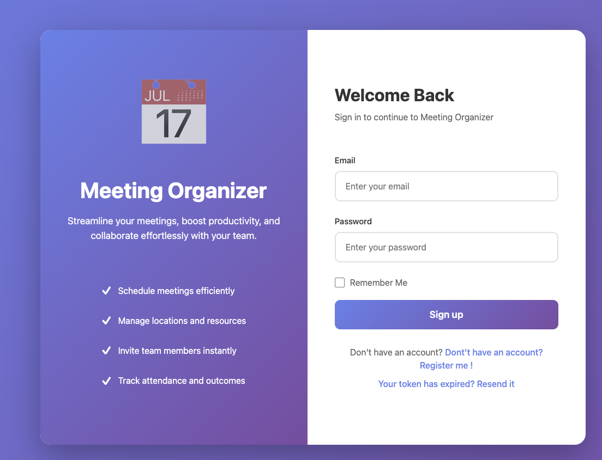
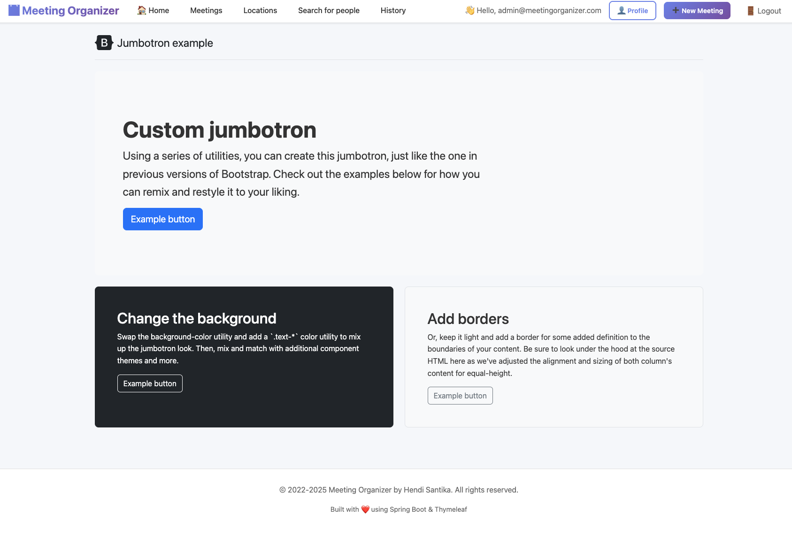
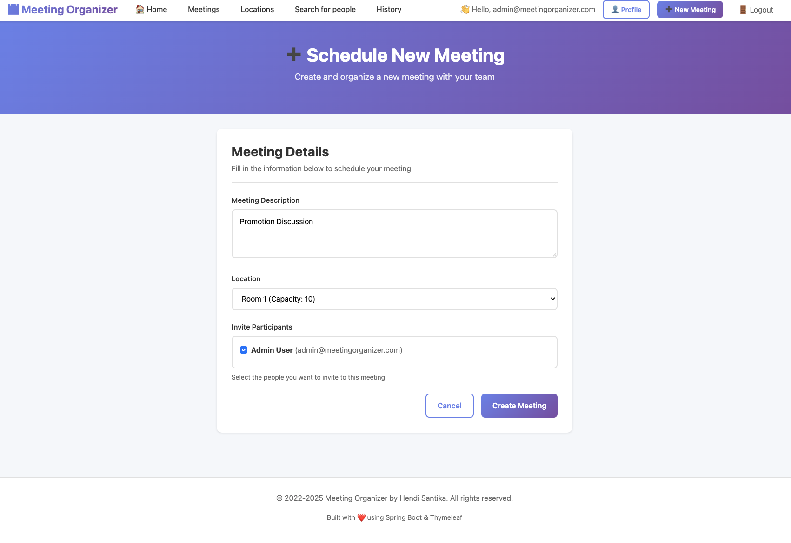
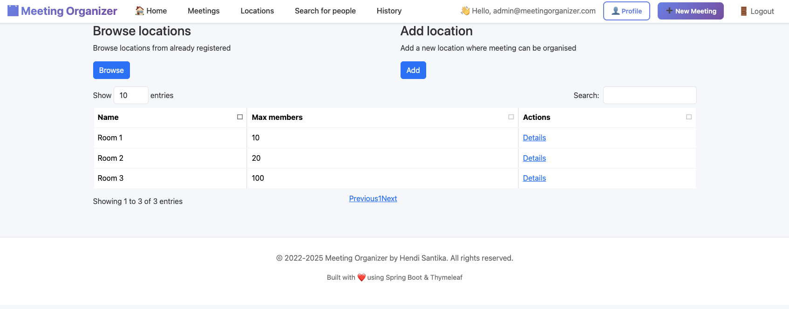
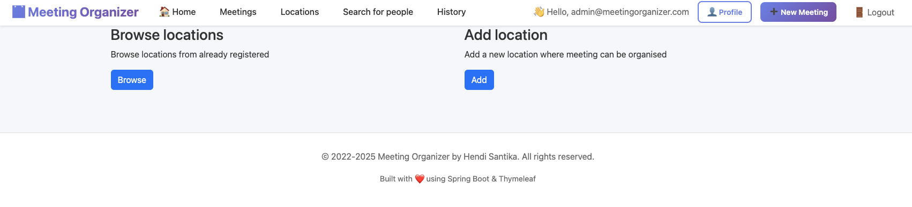
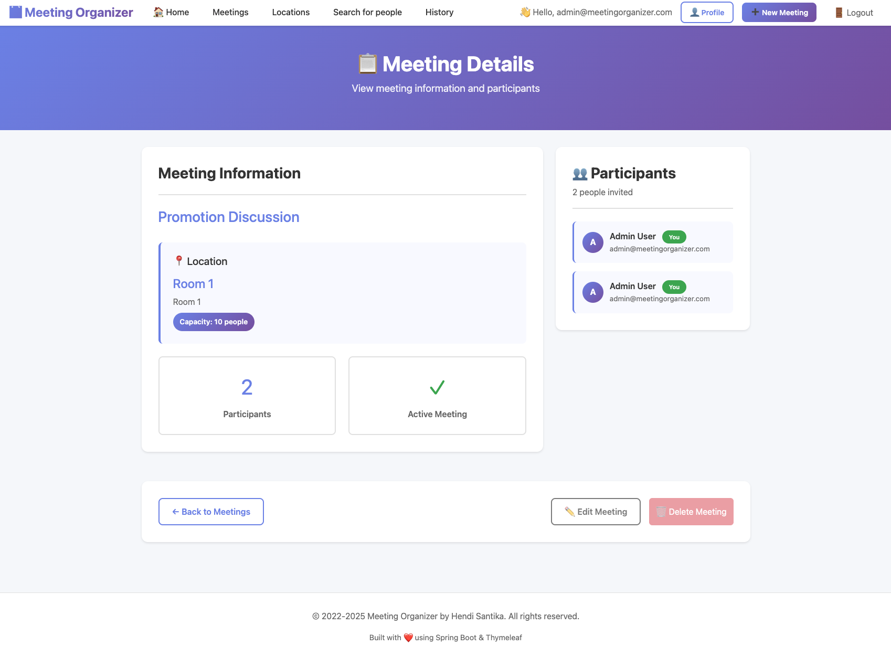
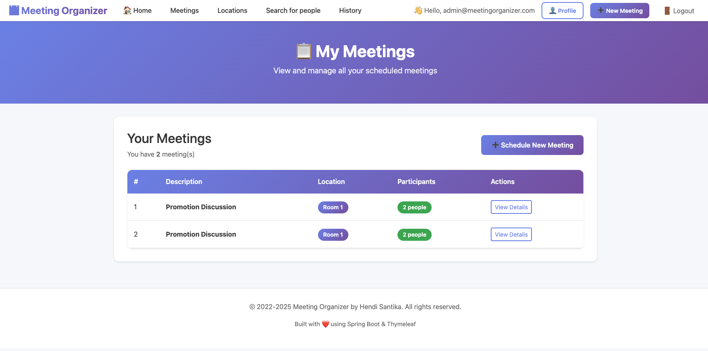
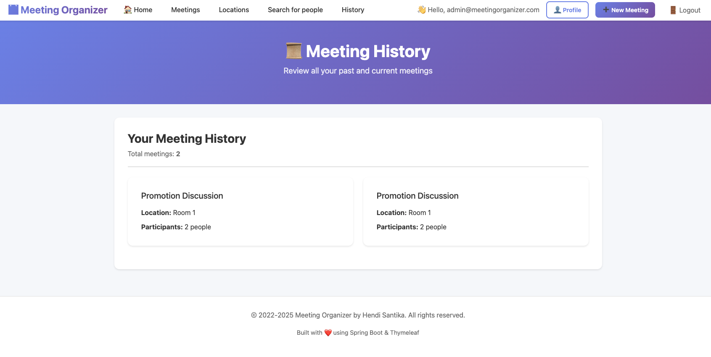
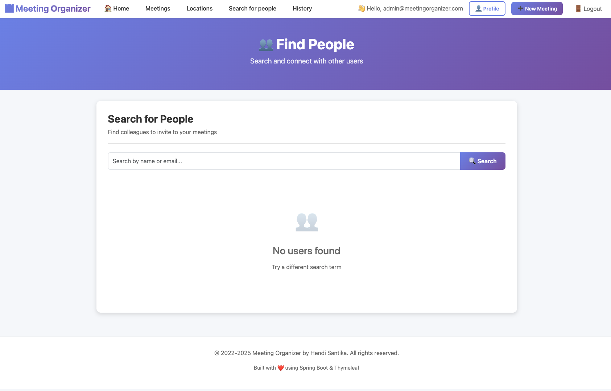

# Meeting Organizer

A Spring Boot application for managing meeting locations, reservations, and user profiles.

## Tech Stack

- **Spring Boot**: 3.5.6
- **Java**: 21
- **Database**: MySQL 9.4.0
- **ORM**: Spring Data JPA with Hibernate
- **Security**: Spring Security 6
- **Template Engine**: Thymeleaf
- **Frontend**: Bootstrap 5.3.8, jQuery 3.7.1
- **Build Tool**: Maven
- **Containerization**: Docker & Docker Compose

## Features

- User registration and authentication
- User profile management with profile pictures
- Meeting location management
- Meeting reservations
- Email verification for new users
- Role-based access control
- Responsive UI with Bootstrap

## Image Screen shots

Login Page



Home Page



Add New Meeting



Browse Location



Location Page



Meeting Details



List Meeting



History Page



People Page



## Prerequisites

- Java 21
- Maven 3.6+
- Docker & Docker Compose (for containerized deployment)

## Database Configuration

The application uses MySQL with the following default credentials:

- **Database**: `meeting_organizer`
- **Username**: `yu71`
- **Password**: `53cret`
- **Port**: `3306`

## Running with Docker Compose

The easiest way to run the application is using Docker Compose:

```bash
docker-compose up -d
```

This will:

1. Start MySQL 9.4.0 container
2. Build and start the Spring Boot application container
3. Automatically create the database if it doesn't exist

The application will be available at: `http://localhost:8081`

## Running Locally (without Docker)

1. Ensure MySQL is running locally
2. Update `src/main/resources/application.properties` if needed
3. Build the application:
   ```bash
   mvn clean package -DskipTests
   ```
4. Run the application:
   ```bash
   java -jar target/meeting-organizer-0.0.1-SNAPSHOT.jar
   ```

Or run directly with Maven:

```bash
mvn spring-boot:run
```

## Development

The application includes `spring-boot-docker-compose` support, which allows automatic Docker Compose service management
during local development.

### Building

```bash
mvn clean install
```

### Running Tests

```bash
mvn test
```

## Docker Configuration

### Dockerfile

Multi-stage build for optimized image size:

- Build stage: Uses `eclipse-temurin:21-jdk-alpine`
- Runtime stage: Uses `eclipse-temurin:21-jre-alpine`

### Docker Compose Services

- **mysql**: MySQL 9.4.0 database with health checks
- **app**: Spring Boot application with automatic restart

## Environment Variables

The following environment variables can be configured in `docker-compose.yml`:

| Variable                     | Default Value                                  | Description             |
|------------------------------|------------------------------------------------|-------------------------|
| `SPRING_DATASOURCE_URL`      | `jdbc:mysql://mysql:3306/meeting_organizer...` | Database connection URL |
| `SPRING_DATASOURCE_USERNAME` | `yu71`                                         | Database username       |
| `SPRING_DATASOURCE_PASSWORD` | `53cret`                                       | Database password       |
| `MYSQL_ROOT_PASSWORD`        | `53cret`                                       | MySQL root password     |
| `MYSQL_DATABASE`             | `meeting_organizer`                            | Database name           |
| `MYSQL_USER`                 | `yu71`                                         | MySQL user              |
| `MYSQL_PASSWORD`             | `53cret`                                       | MySQL user password     |

## Application Configuration

Edit `src/main/resources/application.properties` for local configuration:

```properties
# Server Configuration
server.port=8081
# Database Configuration
spring.datasource.url=jdbc:mysql://localhost:3306/meeting_organizer
spring.datasource.username=yu71
spring.datasource.password=53cret
# JPA/Hibernate Configuration
spring.jpa.hibernate.ddl-auto=update
spring.jpa.show-sql=false
# Mail Configuration (Gmail)
spring.mail.host=smtp.gmail.com
spring.mail.port=587
spring.mail.username=YOUR_EMAIL@gmail.com
spring.mail.password=YOUR_APP_PASSWORD
```

## Default Admin Login

On first startup, the application automatically creates a default admin user:

| Field    | Value                        |
|----------|------------------------------|
| Email    | `admin@meetingorganizer.com` |
| Password | `admin123`                   |
| Role     | `ROLE_ADMIN`, `ROLE_USER`    |

**⚠️ Important**: Please change the default password after your first login!

### Customizing Default Admin Credentials

You can customize the default admin credentials in `application.properties`:

```properties
app.admin.email=admin@meetingorganizer.com
app.admin.password=admin123
app.admin.firstname=Admin
app.admin.lastname=User
```

## Security

The application uses Spring Security 6 with:

- BCrypt password encoding with custom salt
- Form-based authentication
- Remember-me functionality
- Role-based authorization (ROLE_USER, ROLE_ADMIN)
- CSRF protection
- Auto-initialization of default admin user

## API Endpoints

### Public Endpoints

- `/` - Home page
- `/login` - Login page
- `/register` - User registration
- `/register/confirm` - Email verification

### Protected Endpoints (require authentication)

- `/home` - User dashboard
- `/profile/*` - Profile management
- `/locations/*` - Location management
- `/meetings/*` - Meeting management

## Project Structure

```
src/main/java/com/hendisantika/
├── config/          # Spring configuration classes
├── controller/      # REST and MVC controllers
├── domain/          # JPA entities
├── dto/             # Data Transfer Objects
├── event/           # Application events
├── repository/      # Spring Data JPA repositories
├── service/         # Business logic services
├── util/            # Utility classes
└── validation/      # Custom validators
```

## Migration Notes

This project has been migrated from Spring Boot 2.x to 3.5.6:

- `javax.*` packages replaced with `jakarta.*`
- Spring Security configuration updated to use `SecurityFilterChain`
- Hibernate `@Type` annotations removed (now handled automatically)
- Thymeleaf security extras upgraded to `springsecurity6`

## Contributing

1. Fork the repository
2. Create a feature branch
3. Commit your changes
4. Push to the branch
5. Create a Pull Request

## License

This project is licensed under the MIT License.

## Contact

- **Author**: Hendi Santika
- **Email**: hendisantika@gmail.com
- **Telegram**: @hendisantika34

## Troubleshooting

### Docker Build Issues

If you encounter issues during Docker build, try:

```bash
docker-compose down -v
docker-compose build --no-cache
docker-compose up -d
```

### Database Connection Issues

Ensure MySQL is healthy before the app starts:

```bash
docker-compose logs mysql
```

### Port Already in Use

If port 8081 or 3306 is already in use, update the port mappings in `docker-compose.yml`
